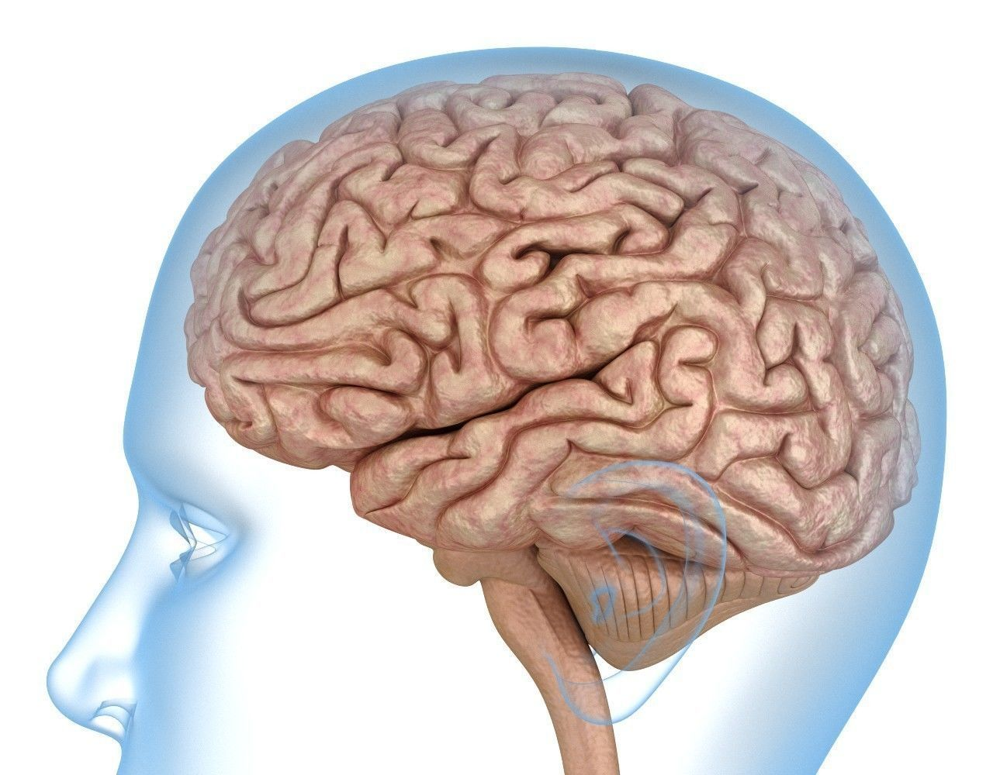

## Trigger warning to psychologists

<!-- Lecture plan, sources and verified numbers: ~/.claude/plans/i-will-send-you-generic-panda.md
     Restructure of 2026-10-06 (general mental models first, climate evidence in section 3): ~/.claude/plans/witty-drifting-tide.md
     Images in images/not_cleared/ come from Mélusine Boon-Falleur's slides
     (resources/sciencespo_melusine_boon_falleur/). They are gitignored. -->

A narrow definition of mental models:

A simplified picture, in someone’s head, of how something works (e.g., climate change as a bathtub [@stermanCloudySkiesAssessing2002]).

. . .

A broader definition I would like to take today:

General features of human psychology that describe how people think, decide, and act across a range of contexts.

::: {.notes}
The bathtub is the example for the narrow sense. Sterman & Sweeney 2002, System Dynamics Review, DOI 10.1002/sdr.242: graduate students were given descriptions of the climate system from the IPCC. From the abstract: "Overall performance was poor. Subjects often select trajectories that violate conservation of matter", and many "believe that stabilizing emissions near current rates would stabilize the climate, when in fact emissions would continue to exceed removal".

The picture: the atmosphere is a bathtub. Emissions are the tap, removal is the drain, and the CO2 concentration is the water level. As long as more flows in than drains out, the level keeps rising, even if the tap is not opened any further. Sterman's wording for the mistaken belief: "analogous to arguing a bathtub filled faster than it drains will never overflow" (https://www.mit.edu/~jsterman/Understanding_public.html).

Only the abstract and Sterman's web page were read.
:::

## Recap

**Week 2 · Public opinion on climate change and the deficit model**\
Can facts change people's minds? Maybe, but they are often not quite enough.

. . .

**Week 3 · A question of trust**\
Without trust in the messenger, it is hard to change minds.

. . .

**TODAY: Week 4 · Mental models and framing**\
How can we communicate more effectively to change minds? By appealing to features of human psychology.

(some of these were teased in Week 1 already)

::: {.notes}
Recap, kept superficial on purpose.
:::

## Overview

1. A quick experiment
2. Mental models
3. Framing effects in climate change communication
4. Revisiting the deficit model

# 1. A quick experiment

##

I will show two slides, one for each half of the room.

. . .

Please look away while the other half is reading.

. . .

Read the text, make your choice, and write it down.

::: {.notes}
Left half reads first, right half closes eyes. Then swap.
:::

## Left half {.smaller}

Imagine that Switzerland is preparing for the outbreak of an unusual disease, which is expected to kill 600 people. Two alternative programs to combat the disease have been proposed. Assume that the exact scientific estimate of the consequences of the programs are as follows:

If Program A is adopted, 200 people will be saved.

If Program B is adopted, there is 1/3 probability that 600 people will be saved, and 2/3 probability that no people will be saved.

Which of the two programs would you favor?

::: {.notes}
Wording from Tversky & Kahneman 1981, Problem 1. Two changes, the same ones Many Labs 1 made: "the U.S." is replaced by the country of data collection, and "Asian" is dropped from "an unusual Asian disease".
:::

## Right half {.smaller}

Imagine that Switzerland is preparing for the outbreak of an unusual disease, which is expected to kill 600 people. Two alternative programs to combat the disease have been proposed. Assume that the exact scientific estimate of the consequences of the programs are as follows:

If Program C is adopted 400 people will die.

If Program D is adopted there is 1/3 probability that nobody will die, and 2/3 probability that 600 people will die.

Which of the two programs would you favor?

::: {.notes}
Wording from Tversky & Kahneman 1981, Problem 2, with the cover story of Problem 1 (as in the original). Same two changes.
:::

##

Left half: who chose Program A?

. . .

Right half: who chose Program C?

::: {.notes}
A and C are the same programme: 200 of the 600 people live for sure. B and D are the same gamble.
:::

## The original study

When the programs were described in terms of lives saved, 72% of participants chose the sure option (Program A).

. . .

When the same programs were described in terms of deaths, only 22% chose the sure option (Program C).

[@tverskyFramingDecisionsPsychology1981]

::: {.notes}
Tversky & Kahneman 1981, Science, DOI 10.1126/science.7455683. Problem 1: N = 152, Program A 72%, Program B 28%. Problem 2: N = 155, Program C 22%, Program D 78%. Students at Stanford University and the University of British Columbia.
:::

##

Programs A and C are the same program. So are B and D.

. . .

The facts are identical. What differs is the wording, and the wording seems to change what people choose.

. . .

This is called a *framing effect*. To understand why it happens, we first need to talk about how the mind works.

## From homo economicus to homo psychologicus

Much of economics and political science starts from *rational choice theory*.

. . .

The main idea: individuals make rational decisions by analysing the costs and benefits of every available option.

. . .

Mental models and framing effects are hard to reconcile with this picture. The costs and benefits of the two programs were identical. Only the description changed.

::: {.notes}
The definition of rational choice theory follows Mélusine Boon-Falleur's lecture 2 ("From Homo Economicus to Homo Bias").
:::

# 2. Mental models

## A (kind of) definition

Features of human psychology that describe how people think, decide, and act...

. . .

... that often seem to deviate from rational choice.

. . .

Many terms for roughly the same idea: heuristics, biases, mental shortcuts.

## The mind as an information-processing device

Input → Computation → Output

::: {.notes}
In cognitive science, people study the mind as an information-processing device.

Information comes in, the mind does something with it, and a perception, a judgement or a decision comes out.

To convince you that our mind is not just a perfect mirror of reality, let's have a look at some well-known optical illusions.
:::

## Which square is darker, A or B?

![[Checker shadow illusion, Edward H. Adelson]{.citation}](images/checker_shadow.png)

::: {.notes}
Image: Wikimedia Commons, "Grey square optical illusion", original by Edward H. Adelson, licence "copyrighted free use".
:::

## They are the same

![[Edward H. Adelson]{.citation}](images/checker_shadow_proof.svg)

::: {.notes}
What happened here?

Squares A and B have exactly the same shade of grey. Yet we see B as lighter.

The visual system does not simply report what is on the screen. It seems to take the shadow into account, and to correct for it.

This correction is fast and automatic. Knowing about it does not make the illusion go away.
:::

## Which monster is bigger?

![[Roger Shepard, Terror Subterra]{.citation}](images/not_cleared/terror_subterra.png)

## Which monster is bigger?

![[Roger Shepard, Terror Subterra]{.citation}](images/not_cleared/terror_subterra_line1.png)

## Which monster is bigger?

![[Roger Shepard, Terror Subterra]{.citation}](images/not_cleared/terror_subterra_line2.png)

## They are the same

![[Roger Shepard, Terror Subterra]{.citation}](images/not_cleared/terror_subterra_lines.png)

## From visual perception to information processing

Visual illusions occur because our brains rely on certain standard operating procedures (e.g., correcting for shadows).

. . .

These procedures use simplified assumptions about how the world works.

. . .

The idea behind today's lecture is that this is also true for information processing.

. . .

Here, we will call these standard operating procedures *mental models*.

## Why do we use mental models?

The world is too complex to reason through every judgement and decision from scratch.

. . .

Most of the time they serve us well. Sometimes they lead to choices that look odd from the outside.

## Today

Today we look at five that matter for communicating about climate change. Four are central to today's reading, the fifth is more recent.

. . .

1. Loss aversion (losses weigh more than gains)
2. Temporal discounting (now beats later)
3. Availability heuristic (experience beats statistics)
4. Social norms (we conform to what others do)
5. Mental accounting (we put money into boxes)

. . .

We first look at each of them in general. In the second half, we come back to them and ask what they mean for communicating about climate change.

::: {.notes}
Term for number 3: availability heuristic (Mélusine Boon-Falleur's lecture 2 calls it availability bias). The reading's own heading is "The Human Brain Privileges Experience Over Analysis".
:::

## 1. Loss aversion

Back to our experiment. Why would "saved" and "die" lead to different choices?

. . .

Tversky and Kahneman's answer: people judge outcomes as gains or losses relative to a reference point, and they treat the two differently.

. . .

"choices involving gains are often risk averse and choices involving losses are often risk taking"

[@tverskyFramingDecisionsPsychology1981]

. . .

In our experiment: faced with a certain loss (400 deaths), most people (78%) preferred the gamble that offered a chance of losing nothing.

::: {.notes}
The quote is from Tversky & Kahneman 1981. The reading (insight 4): "people psychologically evaluate gains and losses in fundamentally different ways". Prospect theory patterns replicated in 19 countries (Ruggeri et al. 2020, n = 4,098: "The results replicated for 94% of items, with some attenuation."). Whether losses in general weigh more than gains is disputed: Gal & Rucker 2018 conclude that "current evidence does not support that losses, on balance, tend to be any more impactful than gains".
:::

## 2. Temporal discounting

Would you rather receive CHF 100 today, or CHF 110 in a year?

::: {.notes}
Hands. The amounts are an illustration. The structure of the choice (10% more after one year) is the first question in Ruggeri et al. 2022, on the next slide.
:::

## Temporal discounting in 61 countries

In 61 countries, 13,629 people were asked this kind of question: an amount of money now, or 10% more in 12 months [@ruggeriGlobalizabilityTemporalDiscounting2022].

. . .

For participants in the United States, this meant US\$500 immediately or US\$550 in one year.

. . .

The result: "Temporal discounting was present in all countries, with only modest variability in national means".

::: {.notes}
Ruggeri et al. 2022, Nature Human Behaviour, DOI 10.1038/s41562-022-01392-w, CC BY 4.0. First choice: "approximately 10% of the national monthly household income average" immediately, "or 110% of that value in 12 months". Those who chose the immediate option were then offered 120%, and then 150%. Caption of Fig. 3: "all locations indicate some preference for immediate over delayed". Also: "countries with lower incomes typically had greater temporal discounting levels in the baseline items". The paper's main interest is in intertemporal choice anomalies: "54% of participants showed at least one anomaly".
:::

## 2. Temporal discounting

"people tend to heavily discount (uncertain) future events when making trade-offs between cost and benefits that accrue at different points in time" [@vanderlindenImprovingPublicEngagement2015]

. . .

This is called *temporal discounting*. Something similar seems to hold for distance more generally: what is far away in time, in space, or from people like us tends to feel less urgent.

::: {.notes}
The quote is from the reading (insight 3, "Out of Sight, Out of Mind: The Nature of Psychological Distance").
:::

##

What causes more deaths: tornadoes or asthma?

::: {.notes}
Hands. Answer according to Mélusine Boon-Falleur's slide on Lichtenstein et al. 1978: tornadoes are seen as more frequent killers, although asthma causes 20 times more deaths. This number is taken from her slide and was not checked in the paper.
:::

## 3. Availability heuristic

When people judge how frequent different causes of death are, their estimates are "systematically biased". Some causes are exaggerated, others underestimated.

. . .

The authors traced this to "disproportionate exposure, memorability, or imaginability". What comes to mind easily seems more frequent.

. . .

The reading states the general point as: "The human brain privileges experience over analysis" [@vanderlindenImprovingPublicEngagement2015].

[@lichtensteinJudgedFrequencyLethal1978]

::: {.notes}
Lichtenstein, Slovic, Fischhoff, Layman & Combs 1978, DOI 10.1037/0278-7393.4.6.551, quotes from the abstract. The pattern is often called the availability heuristic. Another example from Mélusine's slides: Gigerenzer 2004 on people avoiding flights after 11 September 2001 and driving instead (not checked).
:::

## 4. Social norms

"People are social beings who respond to group norms" [@vanderlindenImprovingPublicEngagement2015]

. . .

We pay close attention to what others think and do, and we tend to adjust to it.

::: {.notes}
The quote is the heading of insight 2 in the reading.
:::

## Social norms: paying taxes

In the United Kingdom, people who were late with their tax payment received a reminder letter. Some of these letters included a social norm message.

. . .

Across two field experiments with more than 200,000 people, including such messages "increases payment rates for overdue tax" [@hallsworthBehavioralistTaxCollector2017].

. . .

Messages about what others do (descriptive norms) seemed to be more effective than messages about what one ought to do (injunctive norms).

::: {.notes}
Hallsworth, List, Metcalfe & Vlaev 2017, Journal of Public Economics, DOI 10.1016/j.jpubeco.2017.02.003. Abstract: "two large-scale natural field experiments", "administrative data from > 200,000 individuals in the United Kingdom", "Descriptive norms appear to be more effective than injunctive norms". Also: "We find no evidence that loss framing is more effective than gain framing." Only the abstract was read.

Does it replicate? The record is mixed. A meta-analysis of tax nudges (Antinyan & Asatryan 2024, Economic Journal, DOI 10.1093/ej/ueae088): "simple reminders increase the probability of compliance by 2.7 percentage points, while tax morale and deterrence nudges increase compliance by an additional 1.4 and 3.2 percentage points". A study with all income taxpayers in Belgium (De Neve et al. 2021, Journal of Political Economy, DOI 10.1086/713096): "invoking tax morale is not effective and often backfires". Not checked: whether "tax morale" in these two papers includes social norm letters.

Alternative example in the backup slides: hotel towels (Goldstein et al. 2008). Its direct replication failed.
:::

##

Imagine you are about to buy a jacket for \$125 and a calculator for \$15. The calculator is on sale for \$10 at another branch of the store, 20 minutes' drive away. Would you make the trip?

. . .

Now imagine the calculator costs \$125 and is on sale for \$120 at the other branch. Would you make the trip?

::: {.notes}
Hands after each version. Adapted from Tversky & Kahneman 1981, Problem 10. In the original the two versions went to two different groups (N = 93 and N = 88) and the jacket price was swapped as well ($15 in the second version), so that the total was the same.
:::

## 5. Mental accounting

In the original study, 68% were willing to make the trip to save \$5 on a \$15 calculator. Only 29% were willing to make the same trip to save \$5 on a \$125 calculator.

. . .

People do not seem to treat the \$5 as simply \$5. They set it against the price of the item, as if each purchase had its own account.

. . .

This is called *mental accounting*: people seem to keep separate mental budgets, and money in one budget is not treated like money in another.

[@tverskyFramingDecisionsPsychology1981]

::: {.notes}
A second example in the same paper, Problems 8 and 9: after losing a $10 bill, 88% would still buy a $10 theatre ticket. After losing the ticket itself, only 46% would buy another one. Mental accounting effects replicated across 21 countries (Priolo et al. 2026).
:::

# 3. Framing effects in climate change communication

## How does framing relate to mental models?

They are two sides of the same coin.

. . .

A framing effect is the "odd observation", where the same information only packaged slightly differently causes different reactions.

. . .

If similar framing effects are regularly appearing across contexts, we call it a mental model.

## A (kind of) practical definition

How to package the essentially same information slightly differently, by appealing to the mental models.

## {.big-center}

What's the evidence on framing effects in climate change communication?

## 1. Loss aversion and climate change

Climate solutions are often "framed as an immediate loss for society (e.g., higher taxes, reducing energy consumption)" [@vanderlindenImprovingPublicEngagement2015].

. . .

In one experiment, 161 participants read the same information about climate change impacts, framed either in terms of gains or in terms of losses.

. . .

Gain frames led to more positive attitudes towards climate change mitigation than loss frames.

[@spenceFramingCommunicatingClimate2010]

::: {.notes}
Spence & Pidgeon 2010, Global Environmental Change, DOI 10.1016/j.gloenvcha.2010.07.002. Abstract: "gain frames were superior to loss frames in increasing positive attitudes towards climate change mitigation, and also increased the perceived severity of climate change impacts." The text was adapted from the 2007 IPCC report. One small study, see the large tests later in this section.
:::

## Exercise

If people would like to avoid losses more, how does this relate to today's reading, suggesting that positive frames might aid?

. . .

Go read the paper again and discuss with your neighbor (5 minutes).

::: {.notes}
Jan's note: to answer this, we need to introduce probability in loss aversion. Pointer for students: insight 4 in the reading, "Framing the Big Picture: Nobody Likes Losing (but Everyone Likes Gaining)".
:::

## Why gain frames, if people would like to avoid losses?

Two losses are in play here, and they differ in time. Climate solutions are often presented as an immediate and certain loss (e.g., higher taxes). Climate impacts are uncertain losses in the distant future.

. . .

Now beats later: the distant loss may count for less. The loss that people want to avoid most could then be the cost of acting.

. . .

And when losses are uncertain, people tend to gamble, as in our experiment. This "encourages people to conclude that maintaining the status quo may be 'worth the gamble'" [@vanderlindenImprovingPublicEngagement2015].

. . .

The reading therefore suggests talking about "the positive benefits (gains) of immediate action".

::: {.notes}
The reading's passage (insight 4) names both ingredients, time and certainty: "when climate change impacts are framed as potential (i.e., uncertain) losses in the distant future, whereas climate change solutions are framed as certain losses for society at present, it encourages people to conclude that maintaining the status quo may be 'worth the gamble.'" Just before: "prospect theory (Kahneman & Tversky, 1979) demonstrates that people are more risk-seeking in loss domains than they are in gain domains. In particular, people are more reluctant to take action when losses are paired with uncertainty (Tversky & Shafir, 1992)."

The link to temporal discounting on this slide is our reading of that passage. The reading itself stresses the uncertainty. The next slide states a limitation of the temporal discounting step.

Whether losses weigh more than equal gains in general is disputed (Gal & Rucker 2018, see the notes of "1. Loss aversion").
:::

## A limitation: do future losses fade like future gains?

Our answer assumes that now beats later for losses too: a loss in the distant future should count for less than a loss today.

. . .

In the 61-country study, 40.1% of participants showed a different pattern, a gain–loss asymmetry [@ruggeriGlobalizabilityTemporalDiscounting2022].

. . .

The authors' example: people "prefer to receive \$500 now over \$550 in 12 months, but also prefer to pay \$500 now over paying \$550 in 12 months".

. . .

For these people, a future loss does not seem to fade in the way a future gain does. This weakens the temporal discounting step of our answer. The uncertainty step is not affected, since the study did not test risk.

::: {.notes}
What we would expect. Someone who takes $500 now over $550 in a year tells us that money in a year is worth clearly less to them than money today. If now beats later in the same way for losses, the same person should prefer to pay $550 in a year over paying $500 today, because the later payment should also feel smaller. Our answer on the previous slide uses exactly this logic: the climate loss is far away, so it shrinks, and the immediate cost of acting looms larger.

What Ruggeri et al. 2022 find. Many people do the opposite for losses. They take the money now, and they also pay now, although paying later would be the consistent choice. The paper calls this gain–loss asymmetry: "Gains are discounted more than losses". It was the most common of the anomalies they tested: "from 13.8% for absolute magnitude to 40.1% for gain–loss asymmetry", and "Gain–loss rates were the most common anomaly in 80.3% (49) of the countries".

Why this matters for us. These people accept a smaller loss today to avoid a larger loss later. This is the kind of choice climate action asks for. So a delayed loss does not simply fade for them, and "the distant loss counts for less" is weaker than it sounds on the previous slide. Note that this does not go against loss aversion itself. It fits the idea that people take losses seriously, also when they lie in the future. What it goes against is the combination we used: loss aversion plus temporal discounting.

What it does not show. 40.1% is a minority of participants. The choices are about money, with delays of 12 months. And risk was not part of the task: "we do not explicitly test risk in the temporal measures". Climate impacts are uncertain and decades away. The part of our answer that rests on uncertainty ("worth the gamble") is untouched, and this is the part the reading itself stresses.
:::

## 2. Temporal discounting and climate change

For many people, climate change is distant in all three ways at once: "a nonurgent and psychologically distant risk—spatially, temporally, and socially" [@vanderlindenImprovingPublicEngagement2015].

. . .

The reading's advice follows from this: "Emphasize the present and make climate change impacts and solutions locally relevant."

::: {.notes}
The quote is from the reading (insight 3, "Out of Sight, Out of Mind: The Nature of Psychological Distance"), the advice from its Table 1.
:::

## Discounting in a climate game

In a group experiment framed around climate change, participants could contribute money to avoid a collective loss.

. . .

The rewards of cooperating were paid out after one day, after seven weeks, or several decades later.

. . .

The longer the delay, the less the groups cooperated. Gains "delayed significantly into the future" were found to "markedly diminish cooperation".

[@jacquetIntraIntergenerationalDiscounting2013]

::: {.notes}
Jacquet, Hagel, Hauert, Marotzke, Röhl & Milinski 2013, Nature Climate Change, DOI 10.1038/nclimate2024. Abstract: "The rewards of defection were immediate, whereas the rewards of cooperation were delayed by one day, delayed by seven weeks (intragenerational discounting), or delayed by several decades and spread over a much larger" group. Only the abstract was read.
:::

## Framing climate change: themes

7,500 adults in China, Germany, India, the United Kingdom and the United States saw climate messages that varied at random.

. . .

Support for climate policies was higher with a positive frame (opportunity instead of threat), with health and environment themes, and with a global and immediate perspective.

. . .

Among people unconcerned about climate change, positive and health frames increased support.

[@dasandiPositiveGlobalHealth2022]

::: {.notes}
Dasandi, Graham, Hudson, Jankin, vanHeerde-Hudson & Watts 2022, Communications Earth & Environment, DOI 10.1038/s43247-022-00571-x. Conjoint experiment. Messages varied on framing (positive or negative), theme (health, environment, economy, migration), scale (individual, community, national, global) and time (current, 2030, 2050).
:::

## Reframing climate policy

Climate policy is usually justified by the risks of climate change. Would other benefits be more convincing: innovation, green jobs, community, health?

. . .

Two survey experiments with 1,675 participants in total suggest that they are not.

. . .

"simple reframing of climate policy is unlikely to increase public support"

[@bernauerSimpleReframingUnlikely2016]

::: {.notes}
Bernauer & McGrath 2016, Nature Climate Change, DOI 10.1038/nclimate2948 (ETH Zurich). "strategies to garner public support based on the traditional justification of reducing the risks of climate change remain the most effective".
:::

## 3. Availability heuristic and climate change

"Climate change judgements can depend on whether today seems warmer or colder than usual".

. . .

People seem to "use less relevant but available information (for example, today's temperature) in place of more diagnostic but less accessible information (for example, global climate change patterns)".

. . .

Statistics about global averages are hard to experience. A warm day is not.

[@zavalHowWarmDays2014]

::: {.notes}
Zaval, Keenan, Johnson & Weber 2014, Nature Climate Change, DOI 10.1038/nclimate2093, quotes from the abstract ("local warming effect"). One of the five studies in this paper, a priming study, did not replicate in Many Labs 2. This comes up in the interlude.
:::

## Framing climate change: data

The same climate trend can be shown as continuous data (mean temperature) or as binary data (did the lake freeze this winter, yes or no).

. . .

People who saw the binary data perceived the impact of climate change as larger (d = 0.40, N = 799) [@liuBinaryClimateData2025].

. . .

The authors link this to the "boiling frog" effect: a slow, gradual shift is easy to overlook.

::: {.notes}
Liu, Snell, Griffiths & Dubey 2025, Nature Human Behaviour. "our approach does not involve selective data presentation but rather compares different datasets that reflect equivalent trends in climate change over time". A link to mental model 3. The figure is in Anne Urai's Leiden deck 6, p. 6. No open licence found, so no figure here.
:::

## 4. Social norms and climate change

Would you be willing to give 1% of your income to fight climate change?

. . .

What share of people in your country do you think would say yes?

::: {.notes}
Hands for the first question. For the second: more than half, or less than half? The question wording here is simplified, it is not the survey's exact item.
:::

## Most people say yes, and most underestimate how many others do

![[Fig. 3 from @andreGloballyRepresentativeEvidence2024, CC BY 4.0]](images/andre2024_fig3.png)

::: {.notes}
Andre et al. 2024: representative survey in 125 countries, nearly 130,000 people. "69% of the global population expresses a willingness to contribute 1% of their personal income, 86% endorse pro-climate social norms and 89% demand intensified political action." Panel b: actual willingness 69%, average perceived willingness of others 43%. Circles are actual proportions per country, triangles are perceived proportions.
:::

## The same pattern in the United States

![[Fig. 1 from @sparkmanAmericansExperienceFalse2022, CC BY 4.0]](images/sparkman2022_fig1.png)

::: {.notes}
Sparkman, Geiger & Weber 2022, Nature Communications, DOI 10.1038/s41467-022-32412-y. N = 6,119. Grey shapes: what people think the level of support is. Red lines: actual support from national polls. "While 66–80% Americans support these policies, Americans estimate the prevalence to only be between 37–43% on average." RE = renewable energy.
:::

## Telling people what others think

If people underestimate how much others care about climate change, the norm they respond to is weaker than the real one. This could hold climate action back.

. . .

Our mental model 4 suggests a simple fix: tell people how many others care.

. . .

Across 11 countries, people did underestimate the share of others who hold pro-climate views, by 7.5% in Indonesia and up to 20.8% in Brazil [@geigerWhatWeThink2025].

. . .

Giving them the actual numbers, however, was "largely ineffective".

::: {.notes}
Andre et al. 2024 make the first point: "This perception gap, combined with individuals showing conditionally cooperative behaviour, poses challenges to further climate action." Geiger et al. 2025, n = 3,653 in 11 countries. Providing information about the actual public consensus "was largely ineffective, except for a slight increase in willingness to express one's proclimate opinion".
:::

## 5. Mental accounting and carbon taxes

![[Fig. 2 from @musDesigningAcceptableFair2023, CC BY 4.0]](images/mus2023_fig2.png)

::: {.notes}
Mus, Mercier & Chevallier 2023. Support for a carbon tax increase on a ten-point scale, with revenues either not earmarked or earmarked for environmental protection. UK: N = 706, d = 0.23. France: N = 429, d = 0.71.
:::

## Mental accounting and climate change

Carbon taxes meet strong public resistance. How acceptable they are depends on what happens with the revenue.

. . .

Across six experiments in the United Kingdom and France (N = 7,100), a carbon tax was more acceptable when its revenue went to environmental projects [@musDesigningAcceptableFair2023].

. . .

The authors' explanation: people expect money raised in one domain to be spent in that same domain. The same pattern appeared for tobacco taxes and health spending, and for inheritance taxes and social spending.

::: {.notes}
Mus et al. 2023: "people create mental budgets where the origin of revenues is matched thematically with their domain of use". Most support for a mixed scheme: most revenue to green projects, the rest to low-income households.
:::

## Framing climate change: labels

898 Americans chose between otherwise identical products. One of them included a surcharge for emitted carbon dioxide.

. . .

The surcharge was labelled either as a "tax" or as an "offset".

. . .

The label changed the preferences of Republicans and Independents. It did not affect the preferences of Democrats.

[@hardistyDirtyWordDirty2009]

::: {.notes}
Hardisty, Johnson & Weber 2010, Psychological Science, "A Dirty Word or a Dirty World?", DOI 10.1177/0956797609355572. The abstract speaks of "an earmarked tax or an offset", a link to mental accounting.
:::

##

Not every frame builds on one of our five mental models.

. . .

Some frames seem to work through the words that are chosen, or through the values and identities that a message appeals to.

## Framing climate change: words

Is it "global warming" or "climate change"?

. . .

In a survey experiment with 2,267 Americans, Republicans were less likely to say the phenomenon is real when it was called "global warming" (44.0%) than when it was called "climate change" (60.2%).

. . .

Democrats were unaffected by the wording (86.9% and 86.4%).

[@schuldtGlobalWarmingClimate2011]

::: {.notes}
Schuldt, Konrath & Schwarz 2011, Public Opinion Quarterly, DOI 10.1093/poq/nfq073. "the partisan divide on the issue dropped from 42.9 percentage points under a 'global warming' frame to 26.2 percentage points under a 'climate change' frame".
:::

## Framing climate change: values

Environmental messages are mostly phrased in terms of harm and care, moral concerns that are more deeply held by liberals than by conservatives.

. . .

When pro-environmental messages were reframed in terms of purity, a value that resonates more among conservatives, the difference in environmental attitudes between liberals and conservatives was "largely eliminated".

[@feinbergMoralRootsEnvironmental2012]

::: {.notes}
Feinberg & Willer 2013, Psychological Science, "The Moral Roots of Environmental Attitudes", DOI 10.1177/0956797612449177 (published online 2012). United States.
:::

## The same frame, different audiences

Framing climate action as patriotic increased belief in climate change and support for climate policies in the United States [@masonEffectsSystemsanctionedFraming2024].

. . .

Across 63 countries, similar messages had small effects on average.

. . .

In some countries the frame was moderately successful (Brazil, France, Israel). In others it backfired (Germany, Belgium, Russia).

::: {.notes}
Mason, Vlasceanu & Jost 2024. The message framed pro-environmental initiatives "as patriotic and necessary to maintain the American 'way of life'". The country-level analyses were exploratory. The words and labels examples above show the same thing within the United States: who hears a frame matters. More on identity and motivated reasoning in week 9.
:::

##

These studies suggest that framing matters for climate change communication.

. . .

But most of them are single experiments, and some of them are small.

. . .

Can we trust findings like these? A short interlude.

## Interlude: can a song make you younger?

In 2011, three psychologists reported that students were "nearly a year-and-a-half younger" after listening to "When I'm Sixty-Four" by the Beatles [@simmonsFalsePositivePsychologyUndisclosed2011].

. . .

This is impossible, of course. The authors wanted to show how easily a false finding can be produced.

. . .

Their recipe: more participants and songs than first reported, a convenient control variable, and repeated looks at the data.

::: {.notes}
Simmons, Nelson & Simonsohn 2011, Study 2. Reported: 20 students, "When I'm Sixty-Four" or "Kalimba", adjusted M = 20.1 against 21.5 years, F(1, 17) = 4.92, p = .040. Left out at first: 34 participants and three songs, analyses after about every 10 participants, and father's age as a control. Without that control p = .33.
:::

## Interlude: Thinking, Fast and Slow

In his 2011 bestseller, Daniel Kahneman described studies in which subtle cues changed behaviour. In the best known, students who had worked with words related to old age then walked more slowly down a corridor.

. . .

His verdict at the time: "disbelief is not an option."

. . .

A later replication with automated timing and a larger sample "failed to show priming". In 2017, Kahneman wrote: "I placed too much faith in underpowered studies."

[@doyenBehavioralPrimingIts2012; @schimmackReconstructionTrainWreck2017]

::: {.notes}
These are priming studies. The book passage is quoted as reproduced in Schimmack, Heene & Kesavan 2017: "disbelief is not an option. The results are not made up, nor are they statistical flukes. You have no choice but to accept that the major conclusions of these studies are true." Original study: Bargh, Chen & Burrows 1996 (DOI 10.1037/0022-3514.71.2.230). Replication: Doyen, Klein, Pichon & Cleeremans 2012, PLoS ONE, DOI 10.1371/journal.pone.0029081. Kahneman's sentence is from his comment of 14 February 2017 under the blog post: "What the blog gets absolutely right is that I placed too much faith in underpowered studies."
:::

## Interlude: what held up?

Large teams have since repeated many classic studies with thousands of participants.

. . .

Framing effects mostly held. The disease problem replicated at about half its original size, and the calculator problem replicated as well.

. . .

Priming effects mostly did not. Showing people a flag or banknotes had no measurable effect, and heat-related words did not change concern about global warming.

. . .

So the classic framing effects seem to be real, but often smaller than first reported.

[@kleinInvestigatingVariationReplicability2014; @kleinManyLabs22018]

::: {.notes}
Many Labs 1 (Klein et al. 2014, DOI 10.1027/1864-9335/a000178): 13 effects, 36 samples, 6,344 participants. Effect sizes original against replication: disease problem 1.13 against 0.60, allowed/forbidden 0.65 against 1.96, flag priming 0.50 against 0.03, currency priming 0.80 against −0.02. Many Labs 2 (Klein et al. 2018, DOI 10.1177/2515245918810225): 28 findings, 15,305 participants, 15 (54%) replicated, median effect size 0.60 in the originals and 0.15 in the replications. Calculator problem: 49% against 32% made the trip, N = 7,228 (originally 68% against 29%). Heat priming (Zaval et al. 2014, Study 3A): original d = 0.31, replication d = −0.03, N = 4,204.
:::

##

Back to climate change. What happens when frames are tested in large samples, side by side?

## The ten most-cited climate messages

A megastudy tested the ten most-cited climate messaging strategies on 13,544 Americans [@voelkelRegisteredReportMegastudy2026].

. . .

Six of the ten messages changed attitudes, by 1 to 4 percentage points.

. . .

No message increased donations to environmental causes.

::: {.notes}
A megastudy tests many messages at once, in one large sample, on the same outcomes. Voelkel et al. 2026: "Six messages significantly affected multiple preregistered attitudes, with effects ranging from 1 to 4 percentage points." "No message increased pro-environmental donations, suggesting costly behaviours are difficult to influence with messaging alone." "Persuasiveness varied little across party lines". Five replications of three highly cited strategies (N = 3,216) found "limited evidence of persuasive effects".
:::

## Eleven interventions in 63 countries

59,440 participants were assigned to one of 11 interventions designed by experts [@vlasceanuAddressingClimateChange2024].

. . .

Effects were small, and largely limited to people who were not sceptical about climate change to begin with.

. . .

Reducing psychological distance, our mental model 2, strengthened climate beliefs by 2.3%.

. . .

No intervention increased an effortful behaviour, a task that led to trees being planted. Several interventions reduced it.

::: {.notes}
Vlasceanu et al. 2024. "the interventions' effectiveness was small, largely limited to nonclimate skeptics, and differed across outcomes: Beliefs were strengthened mostly by decreasing psychological distance (by 2.3%), policy support by writing a letter to a future-generation member (2.6%), information sharing by negative emotion induction (12.1%), and no intervention increased the more effortful behavior—several interventions even reduced tree planting."
:::

## What should we take from this?

The mental models themselves seem to be real. The classic effects replicate, and people around the world underestimate each other.

. . .

Messages built on them can move attitudes, typically by a few percentage points.

. . .

Costly behaviour is much harder to influence with a message alone.

. . .

And the effect of a frame depends on who is listening.

# 4. Revisiting the deficit model

##

In week 2, the conclusion was that facts alone rarely change minds.

. . .

A recent line of research complicates this picture.

## Conversations with an AI

2,190 people who believed in a conspiracy theory discussed it with an AI model, which responded with evidence tailored to their own arguments [@costelloDurablyReducingConspiracy2024].

. . .

Belief in the conspiracy theory fell by about 20%.

. . .

The effect was still there two months later, even among participants with deeply entrenched beliefs.

::: {.notes}
Costello, Pennycook & Rand 2024. "personalized evidence-based dialogues with GPT-4 Turbo. The intervention reduced conspiracy belief by ~20%. The effect remained 2 months later, generalized across a wide range of conspiracy theories, and occurred even among participants with deeply entrenched beliefs." Their reading: "previous failures in correcting conspiracy beliefs may be due to counterevidence being insufficiently compelling and tailored".
:::

## And for climate change?

Here the picture is more mixed. In two studies, climate sceptics had short conversations with ChatGPT [@hornseyPromiseLimitationsUsing2025].

. . .

The conversations led to small increases in intentions to act, and to less confidence in sceptical views.

. . .

The effects on scepticism itself were inconsistent across the two studies, and they tended to fade over time.

::: {.notes}
Hornsey et al. 2025. Study 1 n = 949, study 2 n = 333. "the effects on reducing scepticism among sceptics are inconsistent across two studies and susceptible to decay over time. Increasing the conversation length from three to six rounds yielded no additional benefit."
:::

## Discussion

If tailored evidence from an AI can change minds, was the deficit model wrong, or were the facts just badly delivered?

. . .

Is a personalised conversation still "facts alone", or is it a form of framing?

. . .

What could go wrong?

## A long list of regularities

![[Cognitive Bias Codex. Design: John Manoogian III, categories: Buster Benson. CC BY-SA 4.0, via Wikimedia Commons]{.citation}](images/cognitive_bias_codex.svg)

::: {.notes}
The codex groups 188 cognitive biases listed on Wikipedia. The point of the slide is the sheer number, nobody needs to read it.
:::

## To take home

Mental models are general features of human psychology that describe how people think, decide, and act. They often seem to deviate from rational choice.

. . .

Framing means packaging essentially the same information differently, by appealing to these mental models. The classic framing effects seem to be real, but smaller than first reported.

. . .

For climate change, large studies suggest that framing helps modestly: a few percentage points on attitudes, and little on costly behaviour.

## References

::: {#refs}
:::

# Backup slides (potentially thrown out)

## Classic example 1: the same beef

Consumers rated ground beef that was labelled either "75% lean" or "25% fat".

. . .

Their evaluations were more favourable for the beef labelled "75% lean".

. . .

The effect became smaller once consumers had actually tasted the meat.

[@levinHowConsumersAre1988]

::: {.notes}
Levin & Gaeth 1988, Journal of Consumer Research, DOI 10.1086/209174. Abstract: "the magnitude of this information framing effect lessened when consumers actually tasted the meat". A link to mental model 3: direct experience weakens the frame.
:::

## Classic example 2: the same operation

People were asked to imagine they had lung cancer, and to choose between surgery and radiation therapy.

. . .

The outcomes were described either as the probability of living or as the probability of dying.

. . .

Surgery was substantially more attractive when the outcomes were framed in terms of living. This held for patients, for graduate students, and for physicians.

[@mcneilElicitationPreferencesAlternative1982]

::: {.notes}
McNeil, Pauker, Sox & Tversky 1982, New England Journal of Medicine, DOI 10.1056/NEJM198205273062103. 238 patients, 491 graduate students, 424 physicians. Only the abstract was read.
:::

## Classic example 3: the same question

In 1941, Americans were asked about speeches against democracy.

. . .

Asked whether the United States should *allow* such speeches, 62% said no.

. . .

Asked whether the United States should *forbid* them, only 46% said yes.

[@ruggExperimentsWordingQuestions1941; numbers as reported in @kleinInvestigatingVariationReplicability2014]

::: {.notes}
Rugg 1941, Public Opinion Quarterly, DOI 10.1086/265467. Numbers as reported in Many Labs 1 (Klein et al. 2014), the original paper was not read.
:::

## What these examples share

In each case the information is the same, or logically equivalent. Only the description differs.

. . .

And in each case the description shifts what people prefer: lean beef, the operation, free speech, or Program A.

## Social norms: hotel towels

Many hotels ask their guests to reuse their towels, with an appeal that focuses on environmental protection.

. . .

In two field experiments, signs saying that "the majority of guests reuse their towels" "proved superior" to this standard appeal [@goldsteinRoomViewpointUsing2008].

. . .

A replication in two hotels in Germany did not confirm this. There, such messages "were not more effective than the standard message" [@bohnerRoomViewpointRevisited2014].

::: {.notes}
Alternative to the tax example in section 2. Goldstein, Cialdini & Griskevicius 2008, Journal of Consumer Research, DOI 10.1086/586910. Replication: Bohner & Schlüter 2014, PLoS ONE, DOI 10.1371/journal.pone.0104086, Study 1 N = 724, Study 2 N = 204: "both standard and descriptive norm messages increased reuse rates compared to a no-message baseline. However, descriptive norm messages were not more effective than the standard message". A pooled Bayesian analysis exists (Scheibehenne, Jamil & Wagenmakers 2016, Psychological Science, DOI 10.1177/0956797616644081). Its abstract could not be read, so its conclusion is not reported here. Only abstracts were read.
:::

## Are these mistakes?

It is tempting to read this list as a catalogue of human irrationality.

. . .

Not everyone agrees. Gigerenzer argues that the evidence for systematic irrationality "suffers from narrow logical norms" and from "selective reporting of research" [-@gigerenzerSupposedEvidenceLibertarian2015].

. . .

For communicators, a more useful reading may be this: these are regular features of how people think, and a message can fit them more or less well.

::: {.notes}
Mélusine Boon-Falleur's lecture 3 ends on the same note: heuristics often satisfice, and many follow a simple logic that minimises costly errors (the "smoke detector principle").
:::

## Your turn

The reading for today gives five pieces of advice for communicating about climate change.

. . .

In pairs, match each of our five mental models to the advice that builds on it.

. . .

Which advice has no match? Which mental model has no advice? (7 minutes)

::: {.notes}
7 minutes of work, 5 minutes of debrief.
:::

## {.smaller}

:::: {.columns}

::: {.column width="35%"}
1. Loss aversion
2. Temporal discounting
3. Availability heuristic
4. Social norms
5. Mental accounting
:::

::: {.column width="65%"}
A. "Leverage intrinsic motivation to support long-term environmental goals."

B. "Frame policy solutions in terms of what can be gained (not in terms of what is lost)."

C. "Highlight relevant personal experiences through affective recall, stories, and metaphors."

D. "Emphasize the present and make climate change impacts and solutions locally relevant."

E. "Activate and leverage relevant social group norms to promote and increase collective action."
:::

::::

[@vanderlindenImprovingPublicEngagement2015, Table 1]

::: {.notes}
Solution: 1–B, 2–D, 3–C, 4–E. Advice A (intrinsic motivation) has no match. Mental model 5 has no advice, mental accounting is not in the reading. Debrief question: what advice would you write for number 5? Optional example for A from Mélusine's lecture 1: Gneezy & Rustichini 2000, "A Fine is a Price" (DOI 10.1086/468061). A day-care fine for late parents: "the number of late-coming parents increased significantly", and it did not go down again after the fine was removed.
:::
