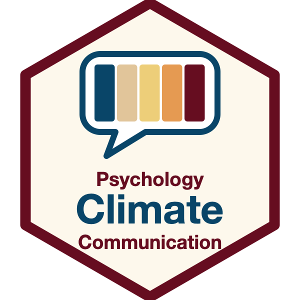

::: {.content-visible when-format="html"}

:::: {.syllabus-header}

::: {.contact}
**[]()**

 [viktoriacologna.com]()
:::

{.syllabus-logo fig-alt="Course hex logo"}

::: {.contact .right}
**[]()**

 [](mailto:)
:::

::::

:::

::: {.content-visible unless-format="html"}

{width=30% fig-align="center"}

**** — <https://www.viktoriacologna.com/>

**** — 

:::

## Course Description

Climate change communication influences how individuals, organizations, and societies perceive climate change, and how they react to it. In this course, we will discuss research findings in environmental psychology and communication science to understand specific challenges of climate change communication and how to address them.

## Learning Objectives

The course will provide students with an overview of current psychological theory and best practices in the area of climate change communication. At the completion of the course, students will be able to:

1. Independently and accurately recognize challenges in climate change communication
2. Clearly describe the psychological mechanisms that influence climate change perceptions and attitudes
3. Critically apply insights from psychology to evaluate the effectiveness of climate change communication
4. Strategically design an effective climate change communication campaign

## General Information

- , room 
-  , weekly,  ()
- An up-to-date schedule can be found on the [course website](index.qmd). This is also where slides and additional materials will be posted.

## Participation

**[TODO: carried over from 2024 UZH syllabus — rewrite]**

Students are expected to actively participate in the course by drawing on their own reading of the materials, as well as their personal experiences and perspectives.

## Materials

**[TODO: carried over from 2024 UZH syllabus — rewrite. OLAT is the UZH platform, ETH uses Moodle.]**

Course plan, reading materials, and slides will be available on OLAT. Please note that no recording will be available for this course.

## Assessment

**[TODO: carried over from 2024 UZH syllabus — rewrite. Exam date below is from the old course (2024).]**

- On-site written exam (3 ECTS) with multiple choice and open questions.
- The exam will take place on 18 December 2024.

## Course Structure

::: {.callout-warning}
## Draft

Topics, descriptions, and literature below are carried over from a previous version of this course taught at UZH. Dates are correct for Autumn 2026, everything else will be revised. Citations are plain text copied from the old reference list. Once `references.bib` is exported from Zotero, they can be replaced by `@bibkeys` (Leiserowitz et al. 2024 and Corner et al. 2018 are missing from the old list).
:::

```{r}
#| echo: false
#| message: false
#| warning: false
#| results: asis
schedule <- read.csv("data/schedule.csv")
lecturer <- ifelse(schedule$lecturer == "TODO", "**[TODO: lecturer]**", schedule$lecturer)
tab <- data.frame(
  n = schedule$session,
  Date = schedule$date,
  Topic = paste0("**", schedule$topic, "** — ", lecturer, "\n\n", schedule$description),
  Literature = schedule$literature
)
# Emit a pandoc grid table (cells converted markdown -> HTML -> pandoc grid
# markdown). Unlike a tinytable, asis markdown passes through pandoc's citation
# processing, so cells can hold full citations now and @bibkeys later.
cell <- function(x) commonmark::markdown_html(x)
rows <- apply(tab, 1, function(r) {
  paste0("<tr>", paste0("<td>", vapply(r, cell, character(1)), "</td>", collapse = ""), "</tr>")
})
html <- paste0(
  "<table><thead><tr>",
  paste0("<th>", c("#", "Date", "Topic", "Literature"), "</th>", collapse = ""),
  "</tr></thead><tbody>", paste(rows, collapse = ""), "</tbody></table>"
)
md <- system2("quarto", c("pandoc", "-f", "html", "-t", "markdown-smart", "--columns=120"),
              input = html, stdout = TRUE)
cat(md, sep = "\n")
cat('\n\n: {tbl-colwidths="[4,11,45,40]"}\n')
```

<!-- Enable when citations go live:
::: {#references}
:::
-->
