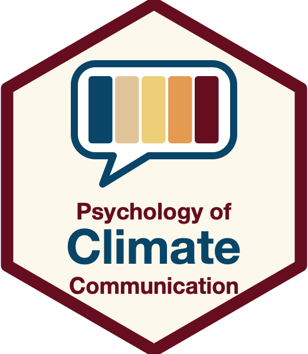

::: {.content-visible when-format="html"}

::: {.instructors}
[]() — [](mailto:)

[]() — [](mailto:)
:::

:::

::: {.content-visible when-format="pdf"}

```{=latex}
\begin{center}
\begin{minipage}[c]{1.2in}
  \includegraphics[width=1.1in]{images/logo.png}
\end{minipage}\hspace{2em}
\begin{minipage}[c]{2in}
  \includegraphics[width=2in]{images/eth_logo.png}
\end{minipage}
\end{center}

\begin{center}
Viktoria Cologna — \href{mailto:viktoria.cologna@eawag.ch}{viktoria.cologna@eawag.ch}\\[2pt]
Jan Pfänder — \href{mailto:janlukas.pfaender@gmail.com}{janlukas.pfaender@gmail.com}
\end{center}
\vspace{0.5em}
```

:::

::: {.content-visible when-format="docx"}

{width=110 fig-alt="Course hex logo"} {width=190 fig-alt="ETH Zurich logo"}

 — 

 — 

:::

## Course Description

Climate change communication influences how individuals, organizations, and societies perceive climate change, and how they react to it. In this course, students explore research from environmental psychology and communication science to understand how people respond to climate change messages and what makes communication effective. Students work in groups to evaluate climate change communication examples and propose evidence-informed improvements, presenting their analyses orally and reflecting on the process in writing. The course is pass/fail based on a group presentation and written individual reflection.

For organisational reasons, participation in this course requires a course-internal commitment at latest by . After this date, groups/projects will be fixed, and students are expected to remain in the course. Students who do not intend to participate must delete the course from myStudies by the commitment deadline.

## Learning Objectives

At the completion of the course, students will be able to:

1. Independently and accurately identify challenges in climate change communication
2. Clearly explain the psychological mechanisms that influence climate change perceptions and attitudes
3. Critically apply insights from psychology to evaluate the effectiveness of climate change communication
4. Develop evidence-informed recommendations for improving climate change messages for specific audiences and communication contexts

## General Information

- , room 
-  –, weekly,  ()
- An up-to-date schedule can be found on the [course website](index.qmd). This is also where slides and additional materials will be posted.
- Students wishing to drop the course need to do so before 

## Participation

Students are expected to actively participate in the course by drawing on their own reading of the materials, as well as their personal experiences and perspectives. Participating means asking deep and challenging questions, but also asking simple clarification questions like “I’m just not getting this, please explain it in some new way” or “I’m lost, can you remind me why we’re talking about this?”. Students are expected to read the main article assigned for each lecture and prepare three questions for each guest speaker.

## Materials

Course plan, reading materials, and slides will be available on Moodle and on . Please note that **no** recording will be available for this course.

## Assessment

This class is not graded, students either pass or fail. Students are expected to prepare for class by completing assigned readings, attend lectures, and meaningfully contribute to in-class exercises and discussion. To pass the class, students need to

1. present an example of climate change communication in an oral group presentation, and
2. submit a one-page individual reflection on the group presentation.

### Oral group presentation

Groups present an example of climate change communication. Presentations start in week 5.

- Presentations last 10 minutes, followed by 5 minutes of Q&A.
- Slides (PowerPoint or similar) are required.
- Any type of content or message that focuses on climate change can be presented as an example, such as an advertisement, political campaign, social media post (video or text), newspaper article, etc. You can present good or bad examples of climate change communication, including messages on climate change denial, and be as creative as you want.
- Presentations need to introduce the content/message, address the following questions, and explicitly draw on relevant concepts learned in the course:
  - Introduce your example. How did you come across it and why did you pick it?
  - Who is the communicator and what is their motivation?
  - Who is the target audience?
  - What makes this a good/bad example of climate change communication? Is the communicator reaching the right target audience with their message/content? Is the chosen medium appropriate to support the message, and why?
  - How could the message/content be improved?
- You can use AI for the preparation of the presentation, but examples should be selected by group members.

### Reflection task

Take some time to reflect on the group presentation following the structure below. Then write down your thoughts in 400–600 words and submit the reflection on Moodle by ****.

In the reflection task, please do the following:

- Describe how your group selected the communication example.
- Clearly state your role in the project and your overall contribution to the group project.
- Describe the group dynamics (e.g., Were there any conflicts? How did you manage the organization, prepare for the presentation, and decide on whether to use AI?). Is there anything you would do differently in hindsight?
- Reflect on your own contribution. Are you happy with your contribution/performance? Would you have liked to do more/less?
- Declare the use of AI in your group. If yes: How did you use it? Which model did you use? In which ways do you think using AI helped you? Do you think there are any downsides to the use of AI for your project?

## Course Structure

::::: {.course-structure}

:::: {.session number="1" lecturer="Viktoria Cologna & Jan Pfänder" topic="Introduction and key concepts in environmental psychology"}

Why is climate change communication important and why is it so challenging?

::: {.literature}
Markowitz, E. M., & Guckian, M. L. (2018). Climate change communication: Challenges, insights, and opportunities. In S. Clayton & C. Manning (Eds.), *Psychology and Climate Change. Human Perceptions, Impacts, and Responses.* (pp. 35–63). Academic Press. <https://doi.org/10.1016/B978-0-12-813130-5.00003-5>
:::

::::

:::: {.session number="2" lecturer="Viktoria Cologna" topic="Public opinion on climate change and the deficit model"}

What is climate change and how does it occur? Does knowledge-focused communication about climate change lead to more concern and engagement? What is the public opinion about climate change?

::: {.literature}
Metag, J., Füchslin, T., & Schäfer, M. S. (2017). Global warming's five Germanys: A typology of Germans' views on climate change and patterns of media use and information. *Public Understanding of Science*, *26*(4), 434–451. <https://doi.org/10.1177/0963662515592558>
:::

::::

:::: {.session number="3" lecturer="Viktoria Cologna" topic="A question of trust"}

Which actors are the most trusted sources of information about climate change? How can we maintain and potentially increase trust in climate change communicators? What is the role of climate scientists in communicating and engaging on the topic?

::: {.literature}
Cologna, V., Kotcher, J., Mede, N. G., Besley, J., Maibach, E. W., & Oreskes, N. (2024). Trust in climate science and climate scientists: A narrative review. *PLOS Climate*, *3*(5), e0000400. <https://doi.org/10.1371/journal.pclm.0000400>
:::

::::

:::: {.session number="4" lecturer="Jan Pfänder" topic="Mental models and framing"}

What are mental models? Which frames are used in climate change communication? How can we frame climate change in a way that allows us to reach different population groups? What are the strategies, channels, and messages used by different stakeholders?

::: {.literature}
van der Linden, S., Maibach, E., & Leiserowitz, A. (2015). Improving Public Engagement With Climate Change: Five “Best Practice” Insights From Psychological Science. *Perspectives on Psychological Science*, *10*(6), 758-763. <https://doi.org/10.1177/1745691615598516>
:::

::::

:::: {.session number="5" lecturer="Viktoria Cologna" topic="Climate change emotions"}

What is the role of emotions in climate change communication? How can we communicate about climate change in a way that increases feelings of self-efficacy? How does media usage relate to behavioral intentions? Group presentations start this week.

::: {.literature}
Stanley, S. K., Hogg, T. L., Leviston, Z., & Walker, I. (2021). From anger to action: Differential impacts of eco-anxiety, eco-depression, and eco-anger on climate action and wellbeing. *The Journal of Climate Change and Health*, *1*, 100003. <https://doi.org/10.1016/j.joclim.2021.100003>
:::

::::

:::: {.session number="6" lecturer="Invited speaker" topic="Guest speaker: Dr. Cornelia Schwierz"}

Dr. Cornelia Schwierz is Head of Climate Monitoring and Information at the Federal Office of Meteorology and Climatology (MeteoSwiss). In her talk, she will tell us about the challenges the Federal Office faces in communicating about climate change and how they overcome them.

::: {.literature}
Preparation: Come to class with at least 3 questions for our guest speaker.
:::

::::

:::: {.session number="7" lecturer="Invited speaker" topic="Guest speaker: Dr. Reto Knutti"}

**[TODO: speaker blurb]**

::: {.literature}
Preparation: Come to class with at least 3 questions for our guest speaker.
:::

::::

:::: {.session number="8" lecturer="Viktoria Cologna" topic="Climate change in the media"}

How has climate change communication in the media evolved over time? How is climate change depicted in the media? How does imagery affect public perceptions of climate change?

::: {.literature}
Metag, J., Schäfer, M. S., Füchslin, T., Barsuhn, T., & Kleinen-von Königslöw, K. (2016). Perceptions of Climate Change Imagery: Evoked Salience and Self-Efficacy in Germany, Switzerland, and Austria. *Science Communication*, *38*(2), 197–227. <https://doi.org/10.1177/1075547016635181>
:::

::::

:::: {.session number="9" lecturer="Jan Pfänder" topic="Climate change misinformation"}

What are discourses that delay action on climate change? How do you identify climate science denial and how do you respond to it?

::: {.literature}
Lewandowsky, S. (2021). Climate Change Disinformation and How to Combat It. *Annual Review of Public Health*, *42*(1), 1-21. <https://doi.org/10.1146/annurev-publhealth-090419-102409>
:::

::::

:::: {.session number="10" lecturer="Invited speaker" topic="Guest speaker: Dr. Leonard Creutzburg"}

Dr. Leonard Creutzburg co-leads the WWF Switzerland One Planet Lab, where he is a project lead for new economic systems. He was a research assistant at ETH Zurich at the Natural Research Policy Group (NARP) and completed his PhD in Economic Geography at the University of Zurich. He will talk to us about the challenges of climate communication from the perspective of a Swiss NGO.

::: {.literature}
Preparation: Come to class with at least 3 questions for our guest speaker.
:::

::::

:::: {.session number="11" lecturer="Jan Pfänder" topic="From communication to behavior change"}

Which behaviors are most effective when it comes to climate change? How can we overcome the intention-action gap? What role can communication play for structural change?

::: {.literature}
Fielding, K.S., & Hornsey, M.J. (2026). Understanding and reducing the intention–behaviour gap in climate action. *Nature Climate Change*, *16*(6), 638-647. <https://doi.org/10.1038/s41558-026-02630-z>
:::

::::

:::: {.session number="12" lecturer="Invited speaker" topic="Guest speaker: Dr. Cornelia Staub"}

**[TODO: speaker blurb]**

::: {.literature}
Preparation: Come to class with at least 3 questions for our guest speaker.
:::

::::

:::: {.session number="13" lecturer="Invited speaker" topic="Guest speaker: Dr. Cornelia Eisenach"}

Dr. Cornelia Eisenach is a science journalist at Republik Magazin, where she writes about health and environmental topics. She holds a PhD in Biology from the University of Glasgow and was a postdoc at the University of Zurich before moving into journalism. In her talk, she will tell us about the challenges of climate change communication in journalism and how to overcome them.

::: {.literature}
Preparation: Come to class with at least 3 questions for our guest speaker.
:::

::::

:::: {.session number="14" lecturer="Viktoria Cologna & Jan Pfänder" topic="Discussion and lessons learnt"}

Based on what we have learned in the previous weeks, we will summarize and discuss successful communication strategies, and reflect on the contributions by our guest speakers and how they relate to what we have learned in the previous sessions.

::::

:::::

<!-- Enable when citations go live:
::: {#references}
:::
-->
